# WikiProjectMed Translation Dashboard

The **WikiProjectMed Translation Dashboard** is a web-based platform designed to facilitate the translation of medical articles from [mdwiki.org](https://mdwiki.org) into various Wikipedia languages. It streamlines the identification of untranslated articles, integrates with MediaWiki's Content Translation tool, and tracks translation progress through a leaderboard system.

---

## 📋 Table of Contents

* [Features](#features)
* [System Architecture](#system-architecture)
* [Installation and Configuration](#installation-and-configuration)
* [Core Components](#core-components)
* [Translation Workflow](#translation-workflow)
* [Data Layer](#data-layer)
* [Leaderboard System](#leaderboard-system)
* [Coordinator Tools](#coordinator-tools)
* [Diagram](#diagram)

---

## Features

* **Article Identification**: Detects medical articles present on mdwiki.org but missing in target languages.
* **Translation Facilitation**: Integrates with MediaWiki's Content Translation tool for seamless translation.
* **Progress Tracking**: Monitors translation progress and contributions via a dynamic leaderboard.
* **Coordinator Tools**: Provides tools for translation coordinators to manage and oversee translation activities.

---

## System Architecture

The dashboard employs a modular architecture, ensuring a clear separation between presentation, business logic, and data access layers. Built primarily using PHP, it interacts with MediaWiki APIs, SPARQL queries, and a custom database to perform its functions.

**Key Components**:

* **Header System**: Manages navigation, authentication, and styling across all pages.
* **Translation System**: Handles translation requests and redirects to the MediaWiki Content Translation tool.
* **Results System**: Displays articles needing translation based on user-selected parameters.
* **Leaderboard System**: Tracks and displays translation statistics by user, language, and campaign.

---

## Installation and Configuration

### Prerequisites

* PHP 7.4 or higher
* MySQL/MariaDB 10.3 or higher
* Apache/Nginx web server
* Composer for dependency management
* Git for version control

### Installation Steps

1. **Clone the Repository**:

   ```bash
   git clone https://github.com/WikiProjectMed/Translation-Dashboard.git
   cd Translation-Dashboard
   ```


2. **Install Dependencies**:

   ```bash
   composer install
   ```


3. **Database Setup**:

   * Create a new MySQL database.
   * Import the schema from `td.sql`.
   * Configure database connection parameters in the configuration files.

4. **Configure Settings**:

   * Adjust settings in the database tables, such as `settings`, `translate_type`, and `categories`.

5. **Authentication Setup**:

   * Ensure the `/auth/` directory exists with the necessary files.
   * Set up user credentials in the authentication database.

---

## Core Components

### Entry Points

* **Main Interface (`index.php`)**: Allows users to select languages and categories for translation.
* **Missing Articles (`missing.php`)**: Displays articles missing in different languages.
* **Translation Redirect (`translate.php`)**: Redirects translation requests to the translation system.
* **Leaderboard (`leaderboard.php`)**: Shows statistics about translations and translators.

### Header System

Implemented in `header.php`, this component:

* Manages user authentication status.
* Generates navigation menus.
* Controls access to coordinator tools.
* Handles theme selection and session initialization.

### Styling

The dashboard uses Bootstrap 5 combined with custom CSS for responsive and accessible design.

---

## Translation Workflow

1. **Initiation**:

   * Users select an article to translate from the Results System.
   * A request is sent to `translate.php` with parameters like article title, target language, category, campaign, and translation type.

2. **Processing**:

   * `translate.php` redirects the request to `translate_med/index.php`.
   * The system checks user authentication, validates parameters, and records the translation attempt in the database.

3. **Redirection**:

   * Users are redirected to the MediaWiki Content Translation interface to begin translating.

---

## Data Layer

The dashboard's data layer supports retrieving data from both the database and MediaWiki APIs, ensuring flexibility and continued operation even if one source is unavailable.

**Key Tables**:

* **`settings`**: Stores core system settings.
* **`translate_type`**: Defines translation types.
* **`categories`**: Maps categories and campaigns.
* **`views`**: Tracks view statistics by language.

---

## Leaderboard System

The leaderboard tracks and displays translation statistics, offering insights into:

* **User Contributions**: Number of translations completed by each user.
* **Language Statistics**: Translations per language.
* **Campaign Progress**: Translations completed within specific campaigns.

Visual representations help in monitoring translation progress and recognizing active contributors.

---
## Coordinator Tools

The **Coordinator Tools** module is a specialized component within the WikiProjectMed Translation Dashboard, designed to empower translation coordinators with administrative capabilities for managing translation projects, monitoring activities, and performing maintenance tasks.

### 🔐 Access Mechanism

Access to the Coordinator Tools is restricted to users with coordinator privileges. Authentication and authorization are managed by the system's Authentication System.

There are two primary entry points for accessing the Coordinator Tools:

1. `coordinator.php`
2. `tools.php`

Both entry points implement an identical redirection mechanism:

* They capture all GET parameters from the URL.
* Preserve these parameters in the redirection URL.
* Redirect the user to the `/tdc/index.php` endpoint, which hosts the main coordinator interface.

### 🧩 System Integration

The Coordinator Tools are integrated into the broader Translation Dashboard system, interacting with various components:

* **Authentication System**: Controls access to the tools based on user roles.
* **Data Access Layer**: Facilitates retrieval and manipulation of data related to translations, users, and campaigns.
* **Configuration Components**: Allow coordinators to adjust system settings pertinent to translation activities.

### 🛠️ Technical Implementation

The redirection mechanism employed by `coordinator.php` and `tools.php` is implemented using PHP:

1. All GET parameters are collected using `http_build_query($_GET)`.
2. These parameters are appended to the target URL `/tdc/index.php`.
3. An HTTP Location header is sent to perform the redirection.

This approach ensures that any filtering, sorting, or view options specified in the URL are preserved during redirection.

### 📋 Inferred Functionality

While the specific functionalities within the Coordinator Tools interface are not exhaustively detailed, based on the system architecture and typical requirements of translation management systems, the following capabilities are likely provided:

* **User Management**:

  * View translator statistics.
  * Assign roles or permissions.
  * Monitor translator activity.

* **Content Management**:

  * Create or edit translation campaigns.
  * Prioritize articles for translation.
  * Mark articles as reviewed or approved.

* **Quality Control**:

  * Review completed translations.
  * Track translation quality metrics.
  * Handle feedback on translations.

* **Reporting**:

  * Generate detailed activity reports.
  * Export statistics and metrics.
  * Monitor overall project progress.

* **System Configuration**:

  * Configure system parameters.
  * Manage language pairs.
  * Set up integration with external systems.

### ⚙️ Parameter Handling

The preservation of URL parameters during redirection suggests that the Coordinator Tools interface is highly configurable, allowing coordinators to tailor views and functionalities based on specific parameters passed through the URL.

## Diagram

```mermaid
graph TD
    %% User Browser
    UB["User Browser"]:::ui

    %% User Interface Layer
    subgraph "User Interface Layer"
        UI1["Results Module"]:::ui
        UI2["Missing Page"]:::ui
        UI3["Leaderboard Module"]:::ui
        UI4["Shared UI Components"]:::ui
    end

    %% Frontend Assets
    subgraph "Frontend Assets"
        FA1["CSS Assets"]:::assets
        FA2["JS Assets"]:::assets
    end

    %% Backend / Business Logic Layer
    subgraph "Backend/Business Logic"
        BE1["Controllers / Auth"]:::backend
        BE2["Actions/API Integration"]:::backend
        BE3["API/SQL Endpoints"]:::backend
        BE4["Table Management"]:::backend
        BE5["Translation Modules"]:::backend
    end

    %% External Services
    ES["Wikidata/mdwiki APIs"]:::external

    %% Testing & Deployment
    subgraph "Testing & Deployment"
        TD1["Testing Suite"]:::testing
        TD2["CI/CD Pipeline"]:::testing
    end

    %% Data Flow Connections
    UB --> UI1
    UB --> UI2
    UB --> UI3
    UB --> UI4

    %% UI Layer loads Frontend Assets (CSS & JS)
    UI1 --- FA1
    UI1 --- FA2
    UI2 --- FA1
    UI2 --- FA2
    UI3 --- FA1
    UI3 --- FA2
    UI4 --- FA1
    UI4 --- FA2

    %% UI Layer interacts with Backend Controllers
    UI1 -->|"triggers"| BE1
    UI2 -->|"triggers"| BE1
    UI3 -->|"triggers"| BE1
    UI4 -->|"provides layout"| BE1

    %% Backend Controllers delegate to other backend components
    BE1 -->|"calls"| BE2
    BE1 -->|"calls"| BE3
    BE1 -->|"renders"| BE4
    BE1 -->|"invokes"| BE5

    %% Backend Actions and API/SQL communicate with External Services
    BE2 -->|"API request"| ES
    BE3 -->|"data query"| ES

    %% Testing and Deployment interactions
    BE1 ---|"tested by"| TD1
    BE2 ---|"tested by"| TD1
    BE3 ---|"tested by"| TD1
    BE4 ---|"tested by"| TD1
    BE5 ---|"tested by"| TD1
    TD2 -->|"deploys"| BE1

    %% Click Events
    click UI1 "https://github.com/mdwiki-td/translation-dashboard/tree/main/results"
    click UI2 "https://github.com/mdwiki-td/translation-dashboard/blob/main/missing.php"
    click UI3 "https://github.com/mdwiki-td/translation-dashboard/tree/main/leaderboard"
    click UI4 "https://github.com/mdwiki-td/translation-dashboard/blob/main/header.php"
    click FA1 "https://github.com/mdwiki-td/translation-dashboard/tree/main/css"
    click FA2 "https://github.com/mdwiki-td/translation-dashboard/tree/main/js"
    click BE1 "https://github.com/mdwiki-td/translation-dashboard/blob/main/coordinator.php"
    click BE2 "https://github.com/mdwiki-td/translation-dashboard/tree/main/actions"
    click BE3 "https://github.com/mdwiki-td/translation-dashboard/tree/main/api_or_sql"
    click BE4 "https://github.com/mdwiki-td/translation-dashboard/tree/main/Tables"
    click BE5 "https://github.com/mdwiki-td/translation-dashboard/tree/main/translate"
    click TD1 "https://github.com/mdwiki-td/translation-dashboard/tree/main/tests"
    click TD2 "https://github.com/mdwiki-td/translation-dashboard/tree/main/.github/workflows"

    %% Styles
    classDef ui fill:#a8d0e6,stroke:#333,stroke-width:2px;
    classDef assets fill:#f6e3b4,stroke:#333,stroke-width:2px;
    classDef backend fill:#c5e1a5,stroke:#333,stroke-width:2px;
    classDef external fill:#ffadad,stroke:#333,stroke-width:2px;
    classDef testing fill:#d1c4e9,stroke:#333,stroke-width:2px;
```

