# Translation Dashboard

## Table of Contents
* [Overview](#overview)
* [Features](#features)
* [Architecture](#architecture)
* [Installation](#installation)
* [Usage](#usage)
* [Contributing](#contributing)
* [License](#license)
* [Contact](#contact)

## Overview
This project is a web-based translation dashboard tool designed to identify Wikidata items that have a page on mdwiki.org but are missing from another Wikipedia language. It is deployed at [mdwiki.toolforge.org](mdwiki.toolforge.org).

## Features

* Identifies Wikidata items missing translations.
* Provides a user interface to manage translations.
* Aggregates and displays ranking-related information (leaderboard).
* Supports user authentication and coordination.
* Includes testing and continuous integration.

## Architecture

This full-stack web application is built using PHP, HTML, CSS, and JavaScript.

**Frontend:**

* **Main Pages:**
    * `results` module (files in the `results` directory, e.g., `SPARQLDispatcher.php`, `fetch_cat_data.php`).
    * `missing` page (`missing.php`).
    * `leaderboard` module (contents of the `leaderboard` directory).
* **Shared UI Components:** (`head.php`, `header.php`, `footer.php`).
* **CSS:** (`css/Responsive_Table.css`, `css/dashboard_new1.css`, etc.)
* **JavaScript:** (`js/login.js`, `js/sorttable.js`, `js/theme.js`, etc.)

**Backend:**

* **Actions/API Integration:** (`actions/mdwiki_api.php`, `actions/td_api.php`, `actions/wiki_api.php`, etc.)
* **API/SQL Endpoints:** (`api_or_sql/data_tab.php`, `api_or_sql/get_lead.php`, `api_or_sql/index.php`).
* **Table Generation & Management:** (`Tables/include.php`, `Tables/sql_tables.php`, `Tables/tables.php`, `Tables/langcode.php`).
* **Controllers/Coordination & Authentication:** (`coordinator.php`, `auth.php`, `index.php`).
* **Translation Modules:** (`translate_med/index.php`, `translate_med/db_insert.php`).

**External Integrations:**

* Wikidata/MDwiki APIs.
* SPARQL endpoints (in the `results` folder).

**Testing & Deployment:**

* Tests directory (`tests/index.php`, `tests/test_fetch_cat_data.php`, `tests/test_fetch_cat_data_sparql.php`).
* Continuous Integration / Deployment Configurations: `.coderabbit.yaml`, `.github/workflows` directory.

## Installation
## Usage
## Contributing
## License
## Contact

## Diagram

```mermaid
graph TD
    %% User Browser
    UB["User Browser"]:::ui

    %% User Interface Layer
    subgraph "User Interface Layer"
        UI1["Results Module"]:::ui
        UI2["Missing Page"]:::ui
        UI3["Leaderboard Module"]:::ui
        UI4["Shared UI Components"]:::ui
    end

    %% Frontend Assets
    subgraph "Frontend Assets"
        FA1["CSS Assets"]:::assets
        FA2["JS Assets"]:::assets
    end

    %% Backend / Business Logic Layer
    subgraph "Backend/Business Logic"
        BE1["Controllers / Auth"]:::backend
        BE2["Actions/API Integration"]:::backend
        BE3["API/SQL Endpoints"]:::backend
        BE4["Table Management"]:::backend
        BE5["Translation Modules"]:::backend
    end

    %% External Services
    ES["Wikidata/mdwiki APIs"]:::external

    %% Testing & Deployment
    subgraph "Testing & Deployment"
        TD1["Testing Suite"]:::testing
        TD2["CI/CD Pipeline"]:::testing
    end

    %% Data Flow Connections
    UB --> UI1
    UB --> UI2
    UB --> UI3
    UB --> UI4

    %% UI Layer loads Frontend Assets (CSS & JS)
    UI1 --- FA1
    UI1 --- FA2
    UI2 --- FA1
    UI2 --- FA2
    UI3 --- FA1
    UI3 --- FA2
    UI4 --- FA1
    UI4 --- FA2

    %% UI Layer interacts with Backend Controllers
    UI1 -->|"triggers"| BE1
    UI2 -->|"triggers"| BE1
    UI3 -->|"triggers"| BE1
    UI4 -->|"provides layout"| BE1

    %% Backend Controllers delegate to other backend components
    BE1 -->|"calls"| BE2
    BE1 -->|"calls"| BE3
    BE1 -->|"renders"| BE4
    BE1 -->|"invokes"| BE5

    %% Backend Actions and API/SQL communicate with External Services
    BE2 -->|"API request"| ES
    BE3 -->|"data query"| ES

    %% Testing and Deployment interactions
    BE1 ---|"tested by"| TD1
    BE2 ---|"tested by"| TD1
    BE3 ---|"tested by"| TD1
    BE4 ---|"tested by"| TD1
    BE5 ---|"tested by"| TD1
    TD2 -->|"deploys"| BE1

    %% Click Events
    click UI1 "https://github.com/mdwiki-td/translation-dashboard/tree/main/results"
    click UI2 "https://github.com/mdwiki-td/translation-dashboard/blob/main/missing.php"
    click UI3 "https://github.com/mdwiki-td/translation-dashboard/tree/main/leaderboard"
    click UI4 "https://github.com/mdwiki-td/translation-dashboard/blob/main/header.php"
    click FA1 "https://github.com/mdwiki-td/translation-dashboard/tree/main/css"
    click FA2 "https://github.com/mdwiki-td/translation-dashboard/tree/main/js"
    click BE1 "https://github.com/mdwiki-td/translation-dashboard/blob/main/coordinator.php"
    click BE2 "https://github.com/mdwiki-td/translation-dashboard/tree/main/actions"
    click BE3 "https://github.com/mdwiki-td/translation-dashboard/tree/main/api_or_sql"
    click BE4 "https://github.com/mdwiki-td/translation-dashboard/tree/main/Tables"
    click BE5 "https://github.com/mdwiki-td/translation-dashboard/tree/main/translate"
    click TD1 "https://github.com/mdwiki-td/translation-dashboard/tree/main/tests"
    click TD2 "https://github.com/mdwiki-td/translation-dashboard/tree/main/.github/workflows"

    %% Styles
    classDef ui fill:#a8d0e6,stroke:#333,stroke-width:2px;
    classDef assets fill:#f6e3b4,stroke:#333,stroke-width:2px;
    classDef backend fill:#c5e1a5,stroke:#333,stroke-width:2px;
    classDef external fill:#ffadad,stroke:#333,stroke-width:2px;
    classDef testing fill:#d1c4e9,stroke:#333,stroke-width:2px;
```

